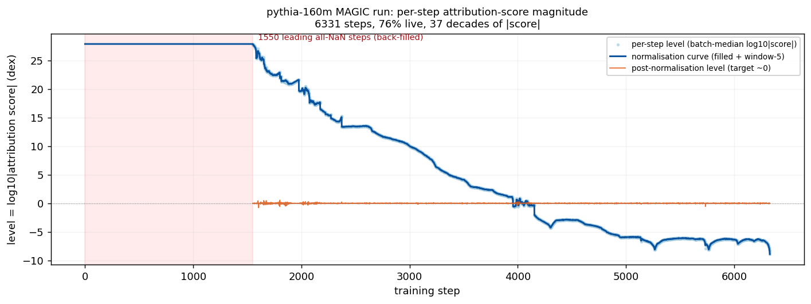
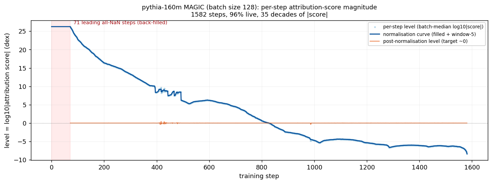

MAGIC (Unrolling)
=================

`MAGIC <https://arxiv.org/abs/2504.16430>`_ attributes evaluation loss to individual training examples by backpropagating through the entire training trajectory.

We provide a `Trainer` class that takes differentiable training steps and handles all three phases of MAGIC attribution. We support FSDP training using the `bergson.magic.dtensor_patch` runtime patch, which makes PyTorch's DTensor redistribution twice-differentiable (`pytorch/pytorch#160509 <https://github.com/pytorch/pytorch/pull/160509>`_). The patch is applied in memory, so no torch source files are modified.

How it works
------------

MAGIC attribution has three phases:

1. **Forward training with checkpoints**: Fine-tune the model, saving intermediate checkpoints at each step.
2. **Evaluate**: Compute the evaluation loss and its gradients with respect to the final model parameters.
3. **Backward through training**: Backpropagate the evaluation gradients through the checkpointed training steps using reverse-mode autodiff, accumulating attribution scores for each training example (or token).

The ``Trainer`` class handles all three phases. It uses `torchopt <https://github.com/metaopt/torchopt>`_ for functional (stateless) differentiable optimization.

Usage
-----

.. code-block:: bash

   CUDA_VISIBLE_DEVICES="0" bergson magic runs/magic-ckpts \
       --data.dataset NeelNanda/pile-10k \
       --query.dataset NeelNanda/pile-10k \
       --query.split "train[:8]" \
       --model EleutherAI/pythia-14m

Output files
------------

After a run completes, ``run_cfg.run_path`` contains:

* ``scores/`` — a score directory, the same self-describing format the
  scoring pipeline writes. ``info.json`` records ``attribute_tokens`` and
  ``num_scores``, so consumers never infer the layout from the shape.
  Read it with :func:`bergson.data.load_scores_loss_signed`, which
  returns ``(scores, multi_query)``:

  * Per-example: ``(num_train_docs, 1)``, indexed directly by ``doc_id``.
  * Per-token: ``(num_chunks, seq_len)``, indexed by ``(chunk_idx,
    token_idx)`` in the *post-shuffle* order used during training.
  * Per-query (``query_method: none``) adds a trailing query axis, so
    per-token per-query scores are ``(num_chunks, seq_len,
    num_query_docs)``.

  Pad rows appended to make the dataset divisible by ``batch_size`` are
  trimmed before saving. Per-token scores are stored ragged — a row holds
  ``length - 1`` values, the positions ``weighted_causal_lm_ce`` can reach
  — and are unpacked back into the dense grid on load.

* ``scores/doc_ids.npy`` — written for every per-token run, shape
  ``(num_chunks, seq_len)`` matching the loaded scores row-for-row. Each
  entry is the original (pre-shuffle) document id for that token position.
  Downstream aggregation is one line:

  .. code-block:: python

     from bergson.data import load_scores_loss_signed

     scores, _ = load_scores_loss_signed("runs/magic/scores")
     doc_ids = torch.from_numpy(np.load("runs/magic/scores/doc_ids.npy"))
     num_docs = int(doc_ids.max()) + 1
     per_doc = torch.zeros(num_docs, dtype=scores.dtype)
     per_doc.scatter_add_(0, doc_ids.flatten(), scores.flatten())

  When ``data.chunk_length > 0`` the ``doc_ids`` column comes from
  ``tokenize_and_chunk`` and chunks may pack multiple docs or split one
  across chunks. When ``chunk_length`` is 0, each row is one document
  and ``doc_ids`` is broadcast from the row's pre-shuffle index; tokens
  past the row's actual length carry zero MAGIC score and contribute
  nothing to the scatter-add.

* ``config.yaml`` — serialized ``MagicConfig`` used for the run.
* ``validation.csv`` — leave-subset-out validation results (if validation
  was run).

Score trajectory
----------------

A MAGIC run processes the shuffled training documents in batches of
``batch_size`` — batch ``s`` is optimizer step ``s`` — so the saved scores group
back into per-step buckets. ``bergson score_trajectory`` plots the per-step
median ``log10|score|`` (the score *level*) against training step:

.. code-block:: bash

   bergson score_trajectory runs/my-magic             # -> runs/my-magic/score_vs_step.png
   bergson score_trajectory runs/my-magic --window 5  # also overlay the step-norm curve

It reads ``<run_path>/scores`` and ``<run_path>/config.yaml`` and writes
``<run_path>/score_vs_step.png``. A smooth, gently-varying band is healthy; a
level that sweeps tens of decades or oscillates ("rings") flags a run whose
attribution may not be trustworthy. It is a direct view of score behaviour —
related to metasmoothness (below), which is a separate check that does not always
predict this instability. ``--window N`` additionally overlays the window-``N``
step-normalisation curve the level would be divided by, and the residual level
after normalising (which should sit near 0).

Requires the optional plotting dependency: ``pip install 'bergson[viz]'``.

   A real pythia-160m MAGIC run. The per-step score level sweeps **~37 orders of
   magnitude** across training, and the leading ~1550 steps carry no score at all
   (red band, back-filled from the first live step) — so a raw score at step 500
   is not comparable to one at step 6000. The orange line is the level after
   step-normalisation, which flattens it to ~0.

Does normalising scores help?
-----------------------------

Because the level drifts so far, an obvious idea is to *step-normalise*: divide
each token's score by its step's level before using the scores — which is what
``--window`` previews. We tested whether drawing leave-subset-out quantiles from
the normalised ranking predicts the measured query-loss change better than the
raw ranking (a linear-datamodeling-score, LDS), on three pythia-160m cells:

.. list-table::
   :header-rows: 1
   :widths: 30 40 30

   * - cell
     - LDS Pearson (raw → normalised)
     - verdict
   * - ``p1_r256_30M``
     - 0.731 → 0.810
     - helped
   * - ``pythia160_full``
     - 0.850 → 0.839
     - no change
   * - ``sweep_b128``
     - 0.647 → −0.046
     - hurt (though effect-size spread tripled)

   ``sweep_b128``: the cleanest of the three trajectories (only ~5% dead steps),
   yet still ~35 decades of range. Normalising its ranking made LDS *worse*.

So step-normalisation is **not a robust win** — one cell improved, one was
unchanged, one was clearly hurt. It is therefore offered only as the opt-in
``score_trajectory --window`` overlay and is never applied to the saved scores.
Caveats: these are pythia-160m (a model we found numerically pathological for
MAGIC), N=5 per cell with no measured noise floor, so a null is ambiguous — treat
the numbers as directional, not conclusive.

Metasmoothness
---------------

MAGIC is valid when the function you are differentiating through is metasmooth. There a few heuristics known to encourage metasmoothness:

* Use the Muon optimizer
* Increase batch size
* Scale model outputs down
* Clip gradients
* Pre-activation batch norm
* QK norm
* Tune weight decay

Many of these methods boil down to "Identify and manage spikes in your training loss." You can measure your metasmoothness with ``bergson metasmoothness``.

Core components
^^^^^^^^^^^^^^^

**Trainer**: Functional trainer that supports forward training with checkpoints and backward-through-training.

.. code-block:: python

   from bergson.magic import BackwardState, DataStream, Trainer, TrainerState
   import torchopt

   # Initialize
   opt = torchopt.adam(lr=1e-4)
   trainer, state = Trainer.initialize(model, opt)

   # Forward training with checkpoints
   stream = DataStream(dataset, batch_size=4, device="cuda")
   state = trainer.train(state, stream, save_dir="checkpoints/")

   # Compute eval gradients, then backward through training
   bwd_state = trainer.backward("checkpoints/", stream, bwd_state, state)
   scores = bwd_state.weight_grads  # attribution scores

**DataStream**: Wraps a dataset with differentiable per-example (or per-token) weights that receive gradients during the backward pass.

.. code-block:: python

   # Per-example attribution
   stream = DataStream(dataset, batch_size=4, device="cuda")

   # Per-token attribution
   stream = DataStream(dataset, batch_size=4, device="cuda", weight_shape=(len(dataset), max_length))

**DTensor patch**: For multi-GPU runs with FSDP, apply the DTensor patch before any distributed operations:

.. code-block:: python

   from bergson.magic.dtensor_patch import apply_dtensor_patch
   apply_dtensor_patch()

   # Your MAGIC worker call here

Per-token vs per-example attribution
^^^^^^^^^^^^^^^^^^^^^^^^^^^^^^^^^^^^^

By default, ``DataStream`` creates a 1D weight tensor ``[n_examples]`` for per-example attribution. By passing a 2D tensor ``[n_examples, max_length]`` as the ``weight_shape`` parameter, each token receives its own attribution score. The ``weighted_causal_lm_ce`` loss function supports both shapes.

To use per-token attribution, set ``model.loss_function = weighted_causal_lm_ce`` so the model uses the weighted loss during training.

.. code-block:: python

   from bergson.utils.math import weighted_causal_lm_ce
   model.loss_function = weighted_causal_lm_ce

Key implementation details
--------------------------

- **Functional optimization**: ``torchopt.adam`` (or similar) provides a pure-function optimizer whose state is a pytree of tensors. This allows ``torch.autograd.grad`` to differentiate through optimizer updates.
- **Checkpoint strategy**: By default, checkpoints are saved at ``sqrt(N)`` intervals, giving ``O(sqrt(N))`` memory and ``O(N)`` recomputation cost. ``save_mode`` also supports ``all`` (``O(N)`` space) and the original MAGIC paper's ``log`` (``O(log N)`` space, ``O(N log N)`` time).
- **FSDP compatibility**: The DTensor runtime patch adds a ``NestedRedistribute`` autograd function that makes the FSDP all-gather/reduce-scatter differentiable through second-order backward passes.
- **Loss weighting**: ``weighted_causal_lm_ce`` multiplies per-token cross-entropy by the DataStream weights before averaging. During backward-through-training, autograd accumulates gradients into these weights, yielding the attribution scores.
